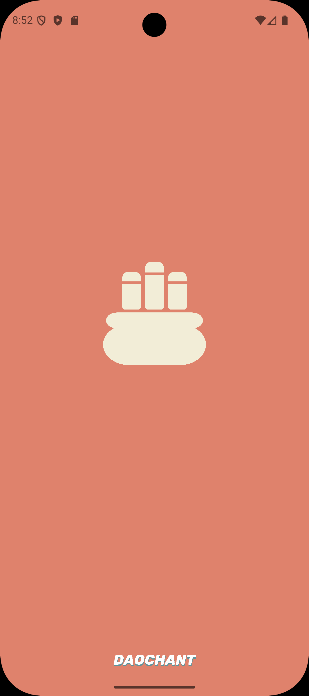
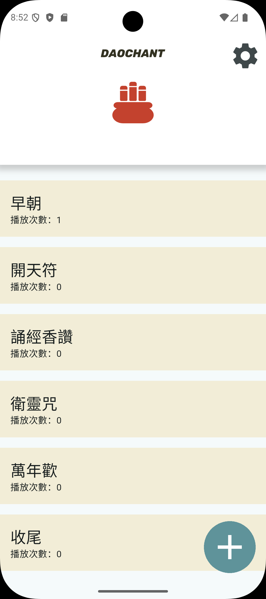
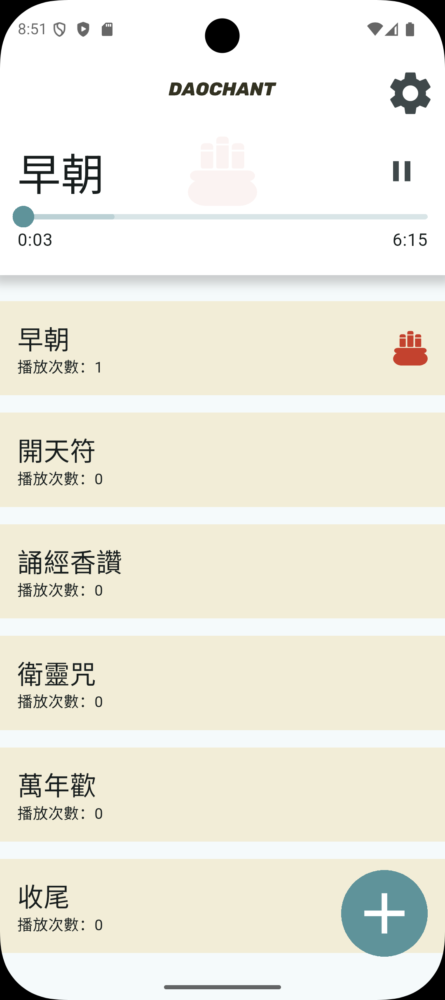

# DaoChant

Welcome to the developer documentation for the DaoChant Flutter application. This document aims to help developers quickly understand the project structure, set up the development environment, and contribute code.

## Project Overview

DaoChant is a Flutter application focused on Taoist music. It allows users to manage Taoist chants and songs, create playlists, and provides a personalized music experience for practitioners and enthusiasts of Taoism.

## Screenshots

<table>
  <tr>
    <td align="center" width="200">
      
    </td>
    <td align="center" width="200">
      
    </td>
    <td align="center" width="200">
      
    </td>
  </tr>
</table>

## Development Environment Setup

1. Install Flutter SDK: [Flutter Installation Guide](https://flutter.dev/docs/get-started/install)
2. Clone the repository:
   ```
   git clone https://github.com/cyan92128505/DaoChant.git
   cd DaoChant
   ```
3. Install dependencies:
   ```
   flutter pub get
   ```
4. Run the code generator:
   ```
   flutter pub run build_runner build --delete-conflicting-outputs
   ```
5. Run the application:
   ```
   flutter run
   ```

## State Management

This project uses Riverpod for state management. Please ensure you are familiar with Riverpod's usage and best practices.

## Data Persistence

We use Hive for local data storage. Please refer to the Hive documentation to understand how to define and use Hive models within the DaoChant context.

## Code Generation

DaoChant utilizes multiple code generation tools, including `freezed`, `json_serializable`, and `riverpod_generator`. After modifying relevant files, please run the following command:

```
flutter pub run build_runner build --delete-conflicting-outputs
```
